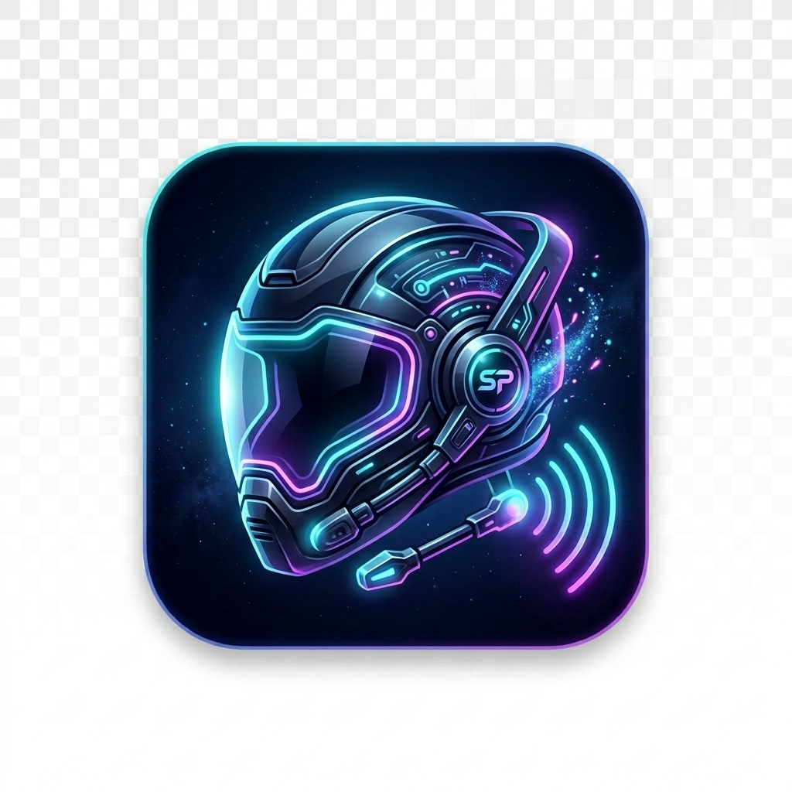

<p align="center">
  
</p>

<h1 align="center">ShadowPilot — macOS</h1>

<p align="center">
  <b>Real-time AI interview copilot that lives in a transparent overlay on your screen.</b><br/>
  Listens to interview questions, captures your screen, and generates tailored answers — all invisible to the interviewer.
</p>

<p align="center">
  
  
  
  
</p>

---

## ✨ Features

| Feature | Description |
|---|---|
| 🎙️ **Live Transcription** | Captures system audio (meeting apps) and transcribes in real-time using Apple's `Speech` framework |
| 🤖 **Multi-Provider AI** | Falls back gracefully: **AWS Bedrock** (Llama 3.3 70B) → **OpenRouter** (GPT-4o) → **OpenAI** (GPT-4o) |
| 📸 **Screenshot Analysis** | One-click screen capture + vision AI to solve coding problems, diagrams, and visual questions |
| 🪟 **Invisible Overlay** | Glassmorphic floating pill that stays on top of all windows — undetectable in screen shares |
| ⌨️ **Global Hotkeys** | Control everything without switching apps — no suspicious alt-tabs |
| 💬 **Follow-up Mode** | Maintains conversation history for context-aware multi-turn answers |
| 👁️ **Whisper Mode** | Answer reveals line-by-line, mimicking natural reading speed on camera |
| ⚡ **Auto-Listen** | Detects silence and automatically triggers AI — fully hands-free |
| 🎯 **Session Context** | Paste the job description + your resume so every answer is role-specific |
| 🗣️ **Filler Phrases** | Shows natural filler text instantly while AI thinks — no awkward pauses |

---

## 🛠 Prerequisites

- **macOS 13.0+** (Ventura or later)
- **Xcode 15+** with Swift 5.9
- **[XcodeGen](https://github.com/yonaskolb/XcodeGen)** — `brew install xcodegen`
- At least **one** API key (Bedrock, OpenRouter, or OpenAI)

---

## ⚡ One-Line Install (Recommended)

Paste this in Terminal and you're done — it handles everything automatically:

```bash
curl -fsSL https://raw.githubusercontent.com/shivanshu814/ShadowPilot-MacOS/main/install.sh | bash
```

This will:
1. ✅ Check macOS version & install Xcode CLI tools if missing
2. ✅ Install Homebrew + XcodeGen if missing
3. ✅ Clone the repo to `~/.shadowpilot`
4. ✅ Prompt you for an API key and save it to `~/.shadowpilot.env`
5. ✅ Build the app and install it to `/Applications/ShadowPilot.app`
6. ✅ Offer to launch immediately

> **Uninstall anytime:** `bash ~/.shadowpilot/uninstall.sh`

---

## 🚀 Manual Setup (Step by Step)

If you prefer doing it yourself:

### 1. Clone the repo

```bash
git clone https://github.com/shivanshu814/ShadowPilot-MacOS.git
cd ShadowPilot-MacOS
```

### 2. Set up environment variables

```bash
cp .env.example .env
```

Open `.env` and fill in at least one API key:

```env
# AWS Bedrock (fastest — Llama 3.3 70B)
BEDROCK_API_KEY=your_bedrock_key_here
BEDROCK_REGION=us-east-1

# OpenRouter (GPT-4o via proxy)
OPENROUTER_API_KEY=sk-or-v1-...

# OpenAI (direct)
OPENAI_API_KEY=sk-...
```

> **Tip:** The app searches for `.env` in multiple locations:  
> `~/.shadowpilot.env` → `~/.env` → project root → app bundle → DerivedData

### 3. Generate the Xcode project

```bash
xcodegen generate
```

### 4. Build & Run

**Option A — Xcode:**
```
Open ShadowPilot.xcodeproj → Select scheme "ShadowPilot" → ⌘R
```

**Option B — Terminal:**
```bash
xcodebuild -scheme ShadowPilot -configuration Debug -derivedDataPath build build
```

Then launch the app:
```bash
open build/Build/Products/Debug/ShadowPilot.app
```

### 5. (Optional) Install to /Applications

```bash
cp -R build/Build/Products/Debug/ShadowPilot.app /Applications/
```

Now you can launch ShadowPilot from **Spotlight** (`⌘ Space` → type "ShadowPilot") or from the **Applications** folder.

---

## 📦 Direct Install (Pre-built .app)

If you don't want to build from source, download the latest `.app` from [Releases](https://github.com/shivanshu814/ShadowPilot-MacOS/releases):

1. Download `ShadowPilot.app.zip` from the latest release
2. Unzip and drag `ShadowPilot.app` to `/Applications`
3. Create your env file:
   ```bash
   cp ~/.shadowpilot.env.example ~/.shadowpilot.env
   # Edit ~/.shadowpilot.env and add your API key
   ```
4. Launch from Applications or Spotlight
5. On first launch, **right-click → Open** to bypass Gatekeeper (unsigned app)

---

## 🔐 First Launch — Grant Permissions

On first launch, macOS will ask for:
- 🎤 **Microphone** — to hear interview questions
- 🗣️ **Speech Recognition** — to transcribe audio
- 🖥️ **Screen Recording** — to capture system audio from meeting apps

> **Note:** If hotkeys don't work, go to **System Settings → Privacy & Security → Accessibility** and add ShadowPilot.

---

## ⌨️ Keyboard Shortcuts

All hotkeys work **globally** — no need to focus the app window.

| Shortcut | Action |
|---|---|
| `⌘⇧L` | Start / Stop listening |
| `⌘⇧A` | Get AI answer |
| `⌘⇧D` | Capture screenshot + analyze |
| `⌘⇧X` | Clear everything |
| `⌘⇧W` | Toggle typing mode |

---

## 🏗 Project Structure

```
ShadowPilot-macOS/
├── install.sh                    # One-click installer (curl | bash)
├── .env.example                  # Environment template
├── project.yml                   # XcodeGen project spec
├── ShadowPilot/
│   ├── ShadowPilotApp.swift      # App entry point
│   ├── AppDelegate.swift         # Menu bar + window management
│   ├── OverlayWindowController.swift  # Floating transparent overlay
│   ├── Info.plist                # Permissions declarations
│   ├── ShadowPilot.entitlements  # macOS entitlements
│   ├── Services/
│   │   ├── EnvConfig.swift       # .env file parser
│   │   ├── AppViewModel.swift    # Core app logic & state
│   │   ├── BedrockService.swift  # AWS Bedrock API (streaming)
│   │   ├── GPTService.swift      # OpenAI / OpenRouter API (streaming)
│   │   ├── HotkeyManager.swift   # Global keyboard shortcuts
│   │   ├── ScreenshotCapture.swift   # ScreenCaptureKit integration
│   │   ├── SpeechRecognizer.swift    # Apple Speech framework
│   │   ├── SystemAudioCapture.swift  # System audio capture
│   │   ├── SilenceDetector.swift     # Silence detection for auto-mode
│   │   └── ConversationTurn.swift    # Chat history model
│   └── Views/
│       ├── ContentView.swift     # Main overlay UI (Spotlight-style bar)
│       ├── SetupView.swift       # Session setup (JD + Resume input)
│       ├── AnswerView.swift      # AI answer display
│       └── MarkdownView.swift    # Markdown rendering
```

---

## 🔑 API Key Priority

The app uses a **waterfall fallback** strategy:

```
1. AWS Bedrock  (Meta Llama 3.3 70B — fastest, cheapest)
       ↓ fails
2. OpenRouter   (GPT-4o via proxy)
       ↓ fails
3. OpenAI       (GPT-4o direct)
```

You only need **one** working key. Bedrock is recommended for lowest latency.

---

## 🔒 Privacy & Security

- All API keys are stored **locally** in `.env` (gitignored by default)
- No data is sent to any server other than the AI provider you configure
- Audio is processed on-device via Apple's Speech framework
- Screenshots are captured locally via ScreenCaptureKit
- The app never stores conversation data to disk

---

## 📋 macOS Permissions

| Permission | Why |
|---|---|
| Microphone | Capture audio to hear interview questions |
| Speech Recognition | Transcribe speech to text on-device |
| Screen Recording | Capture system audio from meeting apps (Zoom, Meet, etc.) |
| Accessibility (optional) | Required for global hotkeys to work in some configurations |

---

## 🤝 Contributing

1. Fork the repo
2. Create a feature branch (`git checkout -b feature/awesome-thing`)
3. Commit your changes (`git commit -m 'Add awesome thing'`)
4. Push to the branch (`git push origin feature/awesome-thing`)
5. Open a Pull Request

---

## 📜 License

This project is licensed under the **MIT License** — see the [LICENSE](LICENSE) file for details.

---

<p align="center">
  <b>Built with ❤️ for interview warriors everywhere.</b><br/>
  <sub>⭐ Star this repo if ShadowPilot helped you land the job!</sub>
</p>
